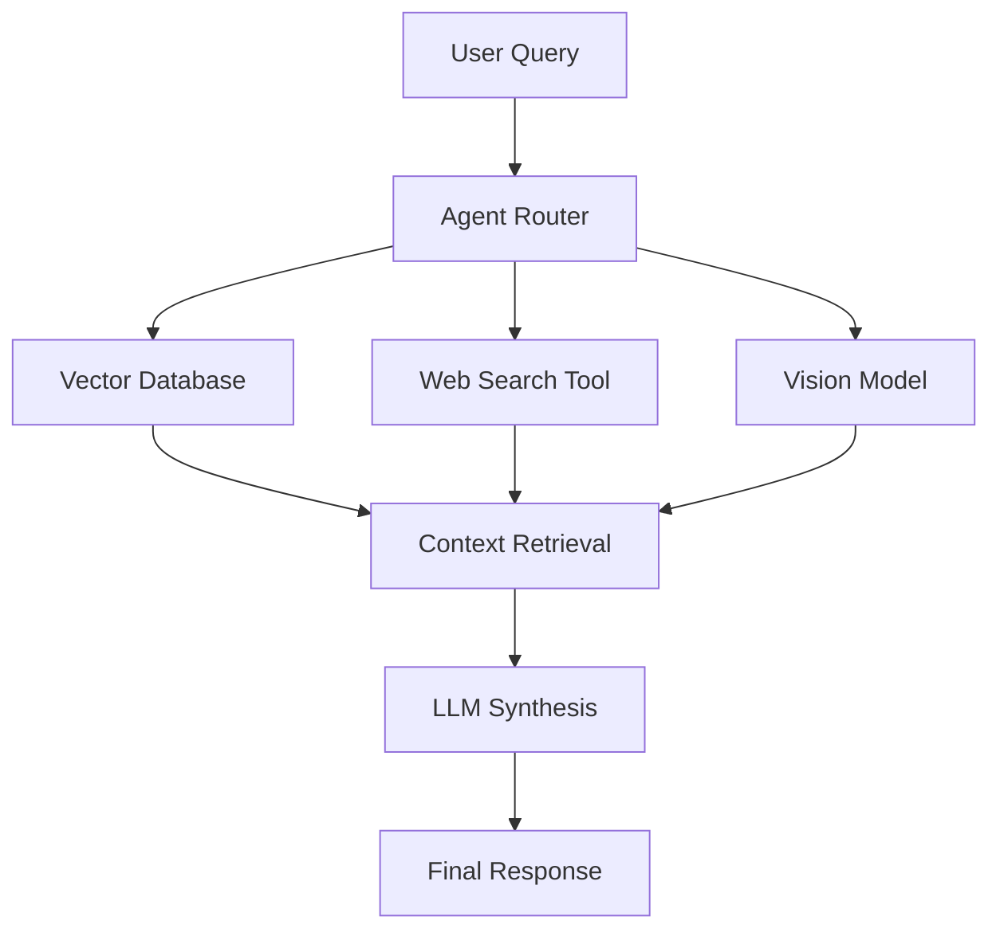

# 🧠 DocuMind Pro: Enterprise-Grade Agentic RAG Workspace

**DocuMind Pro** is a Multi-Modal Agentic RAG system. It uses an **Agentic Router** to dynamically decide between searching internal PDFs, browsing the live web, or analyzing complex visual data.

---

## 🏗️ System Architecture

🚀 Key Features
Intelligent Agent Routing: Automatically detects user intent.

Deep Document Understanding: Ingests and indexes 100+ page PDFs.

Computer Vision Analyst: Interprets charts, diagrams, and physical scenes.

Real-Time Web Connect: Fetches live stock prices and news.

Containerized Deployment: Fully Dockerized for cloud.

🛠️ Tech Stack
Orchestration: LangChain and Phidata

LLM Engine: Groq (Llama 3.2 90B)

Vector Store: ChromaDB

Frontend: Streamlit

Embeddings: HuggingFace

💻 Installation and Usage
Clone the repository:

Bash
git clone [https://github.com/sasy2901/DocuMind_Pro.git](https://github.com/sasy2901/DocuMind_Pro.git)
Install dependencies:

Bash
pip install -r requirements.txt
Run the Application:

Bash
streamlit run app.py
